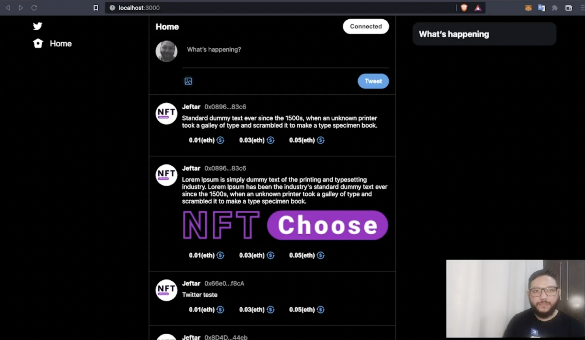

# Dapp Twitter Clone com Web3js e Next.js - P1 - #5 Desenvolvimento blockchain Ethereum com Web3.j

## Para seguir o vídeo use a branch layout/hooks



## Getting Started

First, run the development server:

```bash
npm run dev
# or
yarn dev
```

Open [http://localhost:3000](http://localhost:3000) with your browser to see the result.
